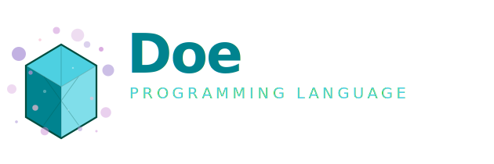

[](https://github.com/azhai/doe/actions/workflows/latest-build.yml) 

[中文版](README-ZH.md)



Doe is a funny and useful language, based on [Zig](https://ziglang.org/) and [Cyber](https://github.com/fubark/cyber). You can embed it into your applications, games, or engines on desktop or web. Doe also comes with a CLI so you can do scripting on your computer.

- [Documentation](https://azhai.github.io/doe)
- [Downloads](https://github.com/azhai/doe/releases)
- [Building](https://github.com/azhai/doe/blob/master/docs/build.md)
- [Contributing](https://github.com/azhai/doe/blob/master/docs/contributing.md)

### Supported Platforms
- Linux x64 (Ubuntu, Fedora, Arch)
- macOS x64
- macOS arm64
- Windows x64
- WASM Web
- WASM WASI

### Install
- Install using the command prompt (Linux, macOS)
```sh
# Install most recent release.
curl -fsSL https://raw.githubusercontent.com/azhai/doe/master/install.sh | bash

# Install most recent dev build.
curl -fsSL https://raw.githubusercontent.com/azhai/doe/master/install.sh | bash -s latest
```
- Install from [Downloads](https://github.com/azhai/doe/releases).

### Usage
- `doer` — VM runner, supports REPL and script execution
- `doec` — JIT compiler, compiles scripts to a WebAssembly module or a native binary file on desktop platforms
